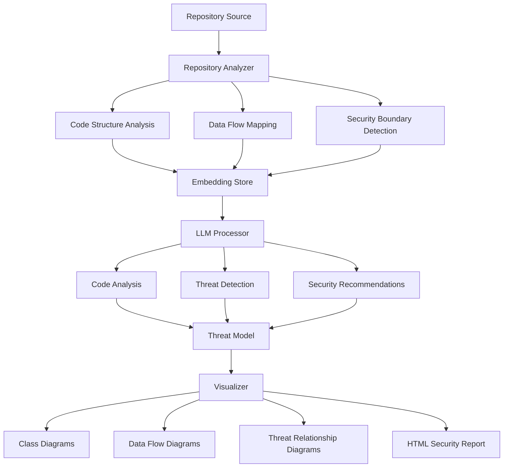

# ThreatMapAI

<div align="center">
  
  <h3>AI-Powered Security Threat Modeling and Visualization</h3>
  <p><em>Automatically analyze codebases to generate comprehensive threat models with attack vectors, data flow diagrams, and security recommendations.</em></p>
</div>


## Table of Contents

- [Overview](#overview)
- [Architecture](#architecture)
- [Features](#features)
- [Requirements](#requirements)
- [Installation](#installation)
- [Usage](#usage)
- [Output Files](#output-files)
- [Advanced Configuration](#advanced-configuration)
- [Troubleshooting](#troubleshooting)
- [Contributing](#contributing)

## Overview

ThreatMapAI is an advanced tool that leverages large language models (LLMs) to automatically analyze code repositories and generate comprehensive security threat models. Using a combination of static code analysis, Retrieval Augmented Generation (RAG), and graph-based visualization, it identifies potential security vulnerabilities, maps data flows across security boundaries, and provides detailed security recommendations.

The tool is designed to be language-agnostic and can analyze repositories of any size through efficient embedding-based RAG techniques.

## Architecture



## Features

### Core Capabilities
- **Unlimited Repository Size Analysis**: Process repositories of any size through efficient embedding-based RAG techniques
- **Multi-Language Support**: Python, JavaScript, TypeScript, Java, Go, PHP, and more
- **Security Boundary Detection**: Automatically identifies security domains and trust boundaries
- **Cross-Boundary Data Flow Analysis**: Identifies and analyzes data flows crossing security boundaries
- **AI-Powered Vulnerability Detection**: Uses LLMs to identify potential security vulnerabilities

### Analysis Components
- **Static Code Analysis**: Parses and analyzes code structure, dependencies, and patterns
- **Data Flow Mapping**: Traces how data moves through the application
- **Security Control Detection**: Identifies existing security controls and gaps
- **Vulnerability Prioritization**: Ranks vulnerabilities by severity and impact

### Visualization & Reporting
- **Interactive Mermaid Diagrams**: Generates class structure, data flow, and threat relationship diagrams
- **Comprehensive HTML Reports**: Detailed security findings with recommendations
- **Exportable Results**: All analysis results available in structured JSON format

## Requirements

- Python 3.8+
- 16GB+ RAM recommended for larger repositories
- 10GB disk space (for model storage)
- GraphViz (for diagram generation)
- GPU support (optional but recommended for larger codebases)

## Installation

### Quick Install (Recommended)

```bash
# Clone the repository
git clone https://github.com/omaid/ThreatMapAI.git
cd ThreatMapAI

# Run the installer (automatically sets up a virtual environment)
chmod +x setup.sh
./setup.sh
```

This will:
1. Create a virtual environment in the `venv` directory
2. Install all dependencies within the virtual environment
3. Download the required model files
4. Set up the configuration

### Manual Installation

If you prefer to set up manually:

1. Create and activate a virtual environment:

```bash
# Create a virtual environment
python3 -m venv venv

# Activate it (on macOS/Linux)
source venv/bin/activate

# OR on Windows
# venv\Scripts\activate
```

2. Install the required Python libraries:

```bash
pip install -r requirements.txt
```

3. Initialize the environment and download required models:

```bash
python -m cli init
```

### Hugging Face Authentication

Some models require authentication with a Hugging Face token:

1. Create a free account at [Hugging Face](https://huggingface.co/join)
2. Generate a token at [https://huggingface.co/settings/tokens](https://huggingface.co/settings/tokens)
3. Set your token:
   ```bash
   python -m cli set_token
   ```

## Usage

### CLI Interface

The primary way to interact with ThreatMapAI is through its command-line interface:

```bash
# Initialize environment and download required models
python -m cli init

# Analyze a GitHub repository
python -m cli analyze https://github.com/username/repo

# Analyze a local repository
python -m cli analyze /path/to/local/repo --local

# Generate visualizations only
python -m cli visualize --output-dir output

# View diagrams in browser
python -m cli view
```

### API Interface

ThreatMapAI can also be used as an API service:

```bash
# Start the API server
python main.py
```

The API server provides endpoints for:
- POST `/analyze` - Analyze a repository
- GET `/health` - Health check

### Python Library Usage

```python
from repository_analyzer.analyzer import RepositoryAnalyzer
from repository_analyzer.embedding_store import EmbeddingStore
from llm_processor.processor import LLMProcessor
from visualizer.visualizer import ThreatModelVisualizer

# Initialize components
embedding_store = EmbeddingStore()
analyzer = RepositoryAnalyzer(repo_path="temp_repo", embedding_store=embedding_store)
llm_processor = LLMProcessor(embedding_store)
visualizer = ThreatModelVisualizer()

# Clone and analyze repository
analyzer.clone_repository("https://github.com/username/repo")
analysis_results = analyzer.analyze_code()

# Generate threat model
threat_model = llm_processor.generate_threat_model(analysis_results)

# Generate visualizations and report
report_path = visualizer.generate_report(threat_model)
print(f"Report generated at: {report_path}")
```

## Output Files

All output is saved to the `output` directory (configurable):

- `analysis_results.json`: Raw analysis data
- `threat_model.json`: Generated threat model
- `class_diagram.mmd`: Class structure diagram
- `flow_diagram.mmd`: Data flow diagram
- `threat_diagram.mmd`: Threat relationship diagram
- `threat_analysis_report.html`: Comprehensive HTML report

### Viewing Diagrams

There are several ways to view the generated Mermaid diagrams:

1. **Using the built-in viewer**:
   ```bash
   python -m cli view
   ```

2. **Using Mermaid Live Editor**:
   - Copy diagram content from .mmd files
   - Paste into [Mermaid Live Editor](https://mermaid.live/)

3. **Using GitHub**:
   - GitHub natively supports Mermaid in Markdown files

4. **Using VS Code**:
   - Install [Mermaid Preview Extension](https://marketplace.visualstudio.com/items?itemName=bierner.markdown-mermaid)

## Advanced Configuration

### GPU Configuration

ThreatMapAI can utilize GPU acceleration for faster processing:

```bash
# Configure GPU settings
python -m cli configure_gpu

# Check GPU information
python -m cli gpu_info --detailed

# Run benchmark
python -m cli gpu_info --benchmark
```

### Model Selection

You can select different models for analysis:

```bash
# List available models
python -m cli select_model --list

# Select a specific model
python -m cli select_model CodeLlama-2-7b-Instruct --variant Q4_0 --download
```

### Environment Variables

Create a `.env` file to configure:

```
MODEL_PATH=/path/to/model
OUTPUT_DIR=output
HF_TOKEN=your_huggingface_token
```

## Troubleshooting

### Installation Issues

1. **Dependency conflicts**:
   - Try creating a fresh virtual environment
   - Install dependencies one by one: `pip install -r requirements.txt --no-deps`
   - Then resolve missing dependencies: `pip install -r requirements.txt`

2. **tree-sitter installation fails**:
   - Install tree-sitter-languages package explicitly: `pip install tree-sitter-languages`
   - Make sure you have a C compiler installed on your system

3. **Model download fails**:
   - Hugging Face may require authentication - use `python -m cli set_token` to set up your token
   - Ensure enough disk space (10GB+ free)

### Runtime Issues

1. **Out of memory**:
   - Use RAG approach: `python -m cli analyze https://github.com/username/repo --memory-limit 4.0`
   - Close other memory-intensive applications
   - Ensure you have at least 16GB of RAM for large codebases

2. **GPU issues**:
   - Force CPU mode if GPU is causing problems: `python -m cli analyze URL --force-cpu`
   - Check GPU support: `python -m cli gpu_info`

3. **Analysis taking too long**:
   - Check your system resources
   - Try analyzing a smaller subset of the codebase

   **Method 2: Set in your environment**
   ```bash
   # Add to your shell profile (.bashrc, .zshrc, etc.)
   export HF_TOKEN=your_token_here
   
   # OR set just for the current session
   export HF_TOKEN=your_token_here
   ```

   **Method 3: Manually add to .env file**
   ```bash
   # Create or edit the .env file in your project directory
   echo "HF_TOKEN=your_token_here" >> .env
   ```

4. **Verify your token is set**
   ```bash
   # Run the initialization which will verify token access
   python -m cli init
   ```

If you see authentication errors even after setting your token, try:
- Ensure you copied the full token without extra spaces
- Restart your terminal if you set it in your environment
- Run `python -m cli set_token` to save it in your .env file 